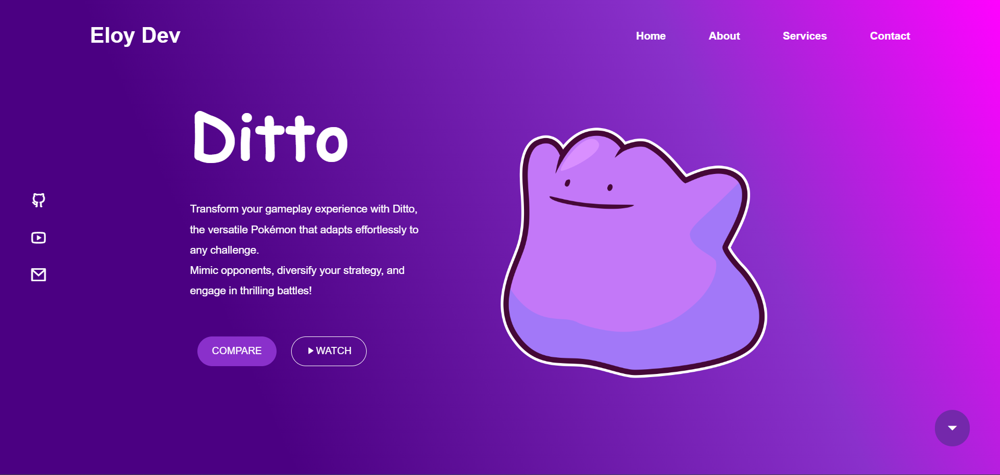

# Ditto Web Project

Este proyecto es una página web dedicada a Ditto, un Pokémon único con la habilidad de transformarse en cualquier otro Pokémon que encuentre. La página web muestra la versatilidad y el potencial estratégico de Ditto en el juego.

## Diseño

La página web se basa en un diseño de Figma. [Haz clic aquí](https://www.figma.com/file/Oj0dfyNhBXpo7tcIaHpond/T4.1-Garcia-Eloy-Responsive-Web?type=design&node-id=0%3A1&mode=dev) para visualizar el diseño original en Figma.

## Características Técnicas

- **Responsive Design**: La página web está diseñada para ser responsive y se adapta a diferentes tamaños de pantalla.
- **Vanilla JavaScript**: El proyecto está construido utilizando JavaScript puro, sin bibliotecas ni frameworks. Nota: Los módulos de JavaScript (import y export) no funcionarán si estás ejecutando tu código directamente desde el sistema de archivos. Para solucionar esto, puedes usar una extensión como [Live Server](https://marketplace.visualstudio.com/items?itemName=ritwickdey.LiveServer) para Visual Studio Code. Esta extensión te permite servir tu proyecto desde un servidor local, permitiendo el uso de módulos de JavaScript.
- **CSS3**: Se utilizó CSS3 para el diseño y la animación de la página web.

## Leyes de UX Implementadas

- **Efecto Von Restorff**: Este efecto se implementa en el botón "Compare". Este botón se destaca del resto de los elementos para captar la atención del usuario.
- **Efecto de Estética-Usabilidad**: El diseño atractivo de la web hace que los usuarios perciban la web como más usable.
- **Ley de la Semejanza**: Esta ley se aplica en el navbar lateral izquierdo. Los elementos que se parecen se perciben como relacionados, lo que ayuda a los usuarios a entender la estructura de la web.

## Características

- Comparación de Pokémon: Compara las habilidades de Ditto con las de cualquier otro Pokémon.
- Videos de juego: Mira videos de Ditto en acción y aprende nuevas estrategias y técnicas de jugadores experimentados.
- Guías de estrategia: Lee nuestras guías de estrategia completas y aprende cómo incorporar a Ditto en tu estrategia de batalla de manera efectiva.

## Autor

Este proyecto fue creado por [eloygar](https://github.com/eloygar).

